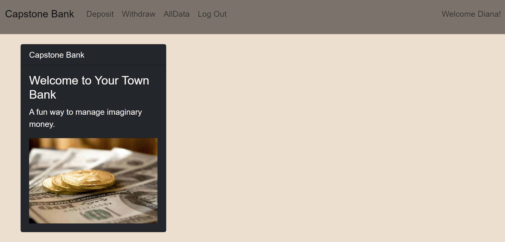

# bank-capstone

This is a refactoring of Module 2 bank project that uses React, AWS, MongoDB, and Studio 3T. This is my final project in my MITxPRO Professional Certificate in Coding through Emeritus.

 
#### Installation:
 
You can check my Module 2 version here: https://rebecca-durst-banking-application.s3.amazonaws.com/index.html#/ Here's a video demo of the Module 2 website too: https://youtu.be/zCzoFa69X7c

Fork the project to your computer. Once you are in the Bank-Capstone-CRA file, cd into the api in the terminal. Then, run <npm start>. This will start the database. Then, you can navigate to http://localhost:3000/account/all to see all of the data. In another terminal, cd into the Bank-Capstone-CRA file. Then, run <npm start>. This will start the website. Then, you can navigate to http://localhost:8080 

#### Usage:

You will be able to create an account and keep track account info. You will also be able to withdraw and deposit into "your account".

#### Support:

I would just check the website version if you can't get a cloned version to work.

#### Roadmap:

I'd like the website to adjust to the screen size.

#### License information:

MIT license
